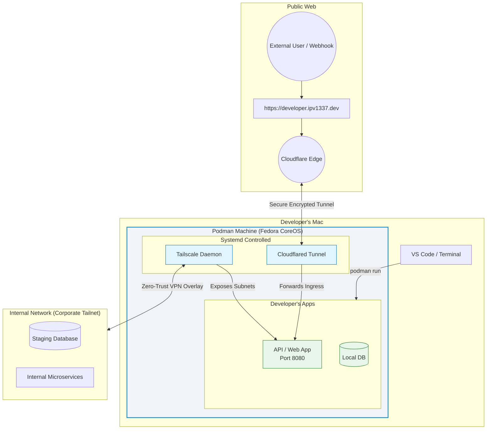

<p align="center">
  <h1 align="center">⚡ devx</h1>
  <p align="center">Supercharged local dev environment — Podman + Cloudflare Tunnels + Tailscale in one CLI</p>
  <p align="center">
    <a href="https://github.com/VitruvianSoftware/devx/actions/workflows/ci.yml"></a>
    <a href="https://github.com/VitruvianSoftware/devx/releases/latest"></a>
    <a href="https://github.com/VitruvianSoftware/devx/blob/main/LICENSE"></a>
    <a href="https://goreportcard.com/report/github.com/VitruvianSoftware/devx"></a>
  </p>
</p>

<p align="center">
  
</p>

## Mission Statement

**devx** exists to bring absolute joy back to local development. 
We relentlessly eliminate the daily friction that pulls developers out of their flow state. From wrestling with inconsistent OS kernels to manually managing `.env` files, mocking webhooks, or resetting scrambled testing databases—we believe your tooling should work natively, instantly, and invisibly so you can just write code.

## Why `devx`? (More than just Compose or Skaffold)

While tools like **Docker Compose** excel at booting containers and **Skaffold** focuses on bridging local code to Kubernetes clusters, `devx` serves as a comprehensive, end-to-end **Local Development Environment Orchestrator**. 

We go far beyond basic container networking by natively integrating the premium capabilities developers usually pay for or duct-tape together into a single, unified CLI:

* 🌐 **Instant Public Ingress:** Stop paying for ngrok. We securely wire your local containers to the internet instantly via Cloudflare Tunnels (`*.ipv1337.dev`), right out of the box.
* 🔒 **Zero-Trust Corporate Access:** Stop fighting with heavy VPN clients. The `devx` VM natively joins your Tailscale mesh silently, giving your local apps direct access to staging and production databases.
* 🧪 **Ephemeral E2E Testing:** Unlike Compose which corrupts your local databases during UI tests, `devx test ui` dynamically clones isolated, randomized copies of your database topology to run Cypress/Playwright tests safely.
* 🔑 **Vault-Native Config Sync:** Stop DMing `.env` files. `devx` connects to 1Password, Bitwarden, or GCP Secret Manager to automatically inject secrets natively directly into process environments.
* 🤖 **AI-Native from Day 1:** Fully compliant with AI Agents (Cursor, Claude Code, Gemina) via deterministic `--json` outputs, `--dry-run` safety mechanisms, and native Agent Skill discovery.
* 🖥️ **Integrated Developer Tools:** We ship with native Bubble Tea TUIs for multiplexed log streaming, webhook HTTP request caching/replay, instant DB state snapshotting, and more.

`devx` provisions a customized **Fedora CoreOS** VM via Podman Machine or Docker and seamlessly drives this entire supercharged ecosystem.

---

## The Solution

```bash
devx vm init    # One command. Done.
```

You get a fully-configured Fedora CoreOS VM with:

- 🌐 **Instant public HTTPS** — Your machine gets `your-name.ipv1337.dev` automatically
- 🔒 **Zero-trust corporate access** — The VM joins your Tailnet transparently
- 🚀 **ngrok-like port exposure** — `devx tunnel expose 3000` gives you a public URL in seconds
- 🏗️ **Host-level isolation** — Pre-tuned `inotify` limits, rootful containers, dedicated kernel

## Installation

### From Releases (recommended)

Download the latest binary from [GitHub Releases](https://github.com/VitruvianSoftware/devx/releases/latest):

```bash
# macOS (Apple Silicon)
curl -sL https://github.com/VitruvianSoftware/devx/releases/latest/download/devx_darwin_arm64.tar.gz | tar xz
sudo mv devx /usr/local/bin/

# macOS (Intel)
curl -sL https://github.com/VitruvianSoftware/devx/releases/latest/download/devx_darwin_amd64.tar.gz | tar xz
sudo mv devx /usr/local/bin/

# Linux (amd64)
curl -sL https://github.com/VitruvianSoftware/devx/releases/latest/download/devx_linux_amd64.tar.gz | tar xz
sudo mv devx /usr/local/bin/
```

### From Source

```bash
go install github.com/VitruvianSoftware/devx@latest
```

### Prerequisites

Run the built-in health check to audit and install prerequisites automatically:

```bash
devx doctor            # check what's installed
devx doctor install    # install missing tools
devx doctor auth       # authenticate required services
```

Or install them manually:

| Tool | Install | Purpose |
|------|---------|---------|
| [Podman](https://podman.io) | `brew install podman` | VM and container runtime |
| [cloudflared](https://developers.cloudflare.com/cloudflare-one/connections/connect-networks/get-started/) | `brew install cloudflare/cloudflare/cloudflared` | Cloudflare tunnel daemon |
| [butane](https://coreos.github.io/butane/) | `brew install butane` | Ignition config compiler |
| [gh](https://cli.github.com) | `brew install gh` | GitHub CLI (for `devx sites`) |

## Quick Start

```bash
# 0. Check your environment (one-time)
devx doctor

# 1. Provision your dev environment
devx vm init

# 2. Run something and expose it
devx exec podman run -d -p 8080:80 docker.io/nginx
# Visit https://your-name.ipv1337.dev — it's live!

# 3. Expose any local port instantly (like ngrok)
devx tunnel expose 3000 --name myapp
# → https://myapp.your-name.ipv1337.dev
```

## Architecture



## 📚 Documentation

The full documentation for `devx`, including all CLI commands, advanced networking, and AI Agent workflows, is available at [devx.vitruviansoftware.dev](https://devx.vitruviansoftware.dev).

## Contributing

We welcome contributions! Please read our [Contributing Guide](CONTRIBUTING.md) for details on:

- Development setup
- Code style and conventions
- Pull request process
- Commit message format

## License

[MIT](LICENSE) © VitruvianSoftware