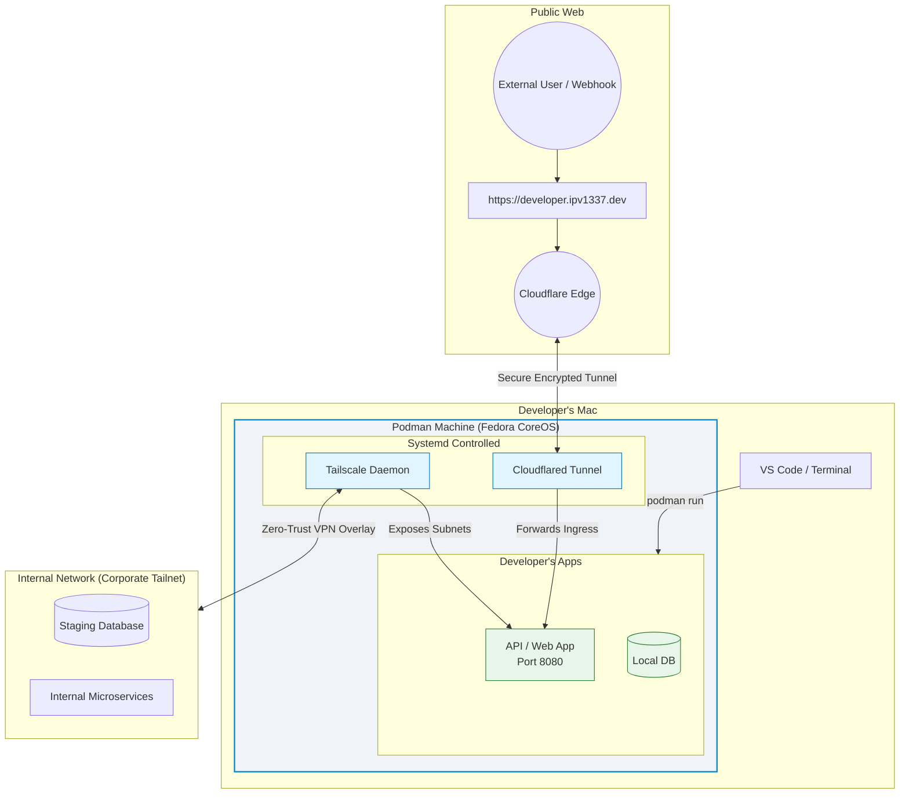

<p align="center">
  <h1 align="center">⚡ devx</h1>
  <p align="center">The unified orchestration layer for your modern developer lifecycle</p>
  <p align="center">
    <a href="https://github.com/VitruvianSoftware/devx/actions/workflows/ci.yml"></a>
    <a href="https://github.com/VitruvianSoftware/devx/releases/latest"></a>
    <a href="https://github.com/VitruvianSoftware/devx/blob/main/LICENSE"></a>
    <a href="https://goreportcard.com/report/github.com/VitruvianSoftware/devx"></a>
  </p>
</p>

<p align="center">
  
</p>

## Mission Statement

**devx** exists to bring absolute joy back to local development. 
We relentlessly eliminate the daily friction that pulls developers out of their flow state. From wrestling with inconsistent OS kernels to manually managing `.env` files, mocking webhooks, or resetting scrambled testing databases—we believe your tooling should work natively, instantly, and invisibly so you can just write code.

## Why `devx`? (More than just Compose or Skaffold)

While tools like **Docker Compose** excel at booting containers and **Skaffold** focuses on bridging local code to Kubernetes clusters, `devx` serves as a comprehensive, end-to-end **Local Development Environment Orchestrator**. 

We go far beyond basic container networking by natively integrating the premium capabilities developers usually pay for or duct-tape together into a single, unified CLI:

### Local Infrastructure
* 🐳 **Container VMs & Providers:** Provision customized Fedora CoreOS VMs via your chosen backend (Podman, Docker, OrbStack, Lima, Colima).
* 🗄️ **Ephemeral Databases & Emulators:** One-click spin up of Postgres, Redis, GCP Cloud Emulators, and local S3 buckets with automatic `.env` injection.
* ☢️ **The Nuke Button:** Instantly hard-reset corrupted project caches, volumes, and images with a single atomic command (`devx nuke`).

### Kubernetes & Hybrid
* 🔗 **Hybrid Bridge to Kubernetes:** Declaratively bridge remote K8s services into `devx up` with `runtime: bridge`. Outbound port-forwarding and inbound traffic interception participate natively in the DAG.
* ☸️ **Zero-Config Local Kubernetes:** Spin up an instant, isolated K3s control plane directly inside your VM without destroying your host machine.
* 🖥️ **Multi-Node Clusters:** Scale your local K8s development beyond a single laptop by provisioning distributed, highly available K3s clusters across multiple physical machines via Lima VMs.

### Networking & Edge
* 🌐 **Instant Public Ingress:** Stop paying for ngrok. Securely wire your local containers to the internet instantly via Cloudflare Tunnels (`*.ipv1337.dev`).
* 📧 **Local Webhook & Email Catchers:** Integrated Bubble Tea TUIs for intercepting, caching, and replaying HTTP webhooks and SMTP traffic locally.

### Orchestration & State
* 🚦 **Intelligent Orchestration:** Seamless DAG-based `depends_on` startup sequences rivaling Docker Compose, plus native Multirepo composing via `include:` directives.
* 🔑 **Vault Secrets Syncing:** Stop DMing `.env` files. `devx` connects to 1Password, Bitwarden, or GCP Secret Manager to inject secrets directly into your containers.
* ⚡ **Smart File Syncing:** Bypass slow VirtioFS volume mounts with intelligent Mutagen-powered file syncing (`devx sync up`) that propagates changes in milliseconds.
* 🔍 **Instant PR Sandboxing:** Review any PR without switching branches. `devx preview 42` creates an isolated worktree with dedicated databases and tunnel URLs, then cleans up automatically on exit.
* ⏪ **Diagnostics & State:** Snapshot and restore complete database volumes using CRIU, plus redact-safe diagnostic dumps for frictionless support (`devx state`).

### Testing & Telemetry
* 🧪 **Ephemeral E2E Testing:** Dynamically clone isolated, randomized copies of your database topology to run Cypress/Playwright tests safely.
* 🩺 **Environment Doctor:** Run the built-in health check (`devx doctor`) to audit, authenticate, and auto-install all prerequisites effortlessly.
* 📊 **Distributed Tracing & Mocking:** Instantly spawn OpenTelemetry backends (Jaeger/Grafana) and Prisma mock servers for complete observability and API isolation.

### Pipelines & CI/CD
* 🔬 **Local CI Emulation:** Debug your GitHub Actions locally with `devx ci run` — matrix expansion, job DAGs, and parallel execution without the "fix ci" commit loop.
* ⏱️ **Predictive Pre-Building:** Local telemetry tracks build durations and proactively nudges you to enable background pre-building to prime container caches.
* 🤖 **AI-Native from Day 1:** Fully compliant with AI Agents via deterministic `--json` outputs, `--dry-run` safety mechanisms, and native Agent Skill discovery.

`devx` provisions a customized **Fedora CoreOS** VM via your chosen backend (Lima, Colima, Docker, OrbStack, or Podman) and seamlessly drives this entire supercharged ecosystem.

---

## Installation

### From Homebrew (recommended for macOS/Linux)

```bash
brew install vitruviansoftware/tap/devx
```

### From Releases

Download the latest binary from [GitHub Releases](https://github.com/VitruvianSoftware/devx/releases/latest):

```bash
# macOS (Apple Silicon)
curl -sL https://github.com/VitruvianSoftware/devx/releases/latest/download/devx_darwin_arm64.tar.gz | tar xz
sudo mv devx /usr/local/bin/

# macOS (Intel)
curl -sL https://github.com/VitruvianSoftware/devx/releases/latest/download/devx_darwin_amd64.tar.gz | tar xz
sudo mv devx /usr/local/bin/

# Linux (amd64)
curl -sL https://github.com/VitruvianSoftware/devx/releases/latest/download/devx_linux_amd64.tar.gz | tar xz
sudo mv devx /usr/local/bin/
```

### From Source

```bash
go install github.com/VitruvianSoftware/devx@latest
```

## Quick Start

### Step 0: Check Prerequisites

Run the built-in health check to audit and install prerequisites automatically:

```bash
devx doctor            # check what's installed
devx doctor install    # install missing tools
devx doctor auth       # authenticate required services
```

<details>
<summary>Manual Installation Prerequisites</summary>

| Tool | Install | Purpose |
|------|---------|---------|
| [Podman](https://podman.io) / [Lima](https://lima-vm.io/) / [Colima](https://github.com/abiosoft/colima) / [Docker](https://docker.com) | | Any VM backend of your choice |
| [cloudflared](https://developers.cloudflare.com/cloudflare-one/connections/connect-networks/get-started/) | `brew install cloudflare/cloudflare/cloudflared` | Cloudflare tunnel daemon |
| [butane](https://coreos.github.io/butane/) | `brew install butane` | Ignition config compiler |
| [gh](https://cli.github.com) | `brew install gh` | GitHub CLI (for `devx sites`, `devx preview`) |

</details>

### Step 1: The Magic (TL;DR)

```bash
devx vm init    # One command. Done.
```

You get a fully-configured Fedora CoreOS VM via your chosen provider with:

- 🌐 **Instant public HTTPS** — Your machine gets `your-name.ipv1337.dev` automatically
- 🔒 **Zero-trust corporate access** — The VM joins your Tailnet transparently
- 🚀 **ngrok-like port exposure** — `devx tunnel expose 3000` gives you a public URL in seconds
- 🏗️ **Host-level isolation** — Pre-tuned `inotify` limits, rootful containers, dedicated kernel

### Path A: The Golden Path (Starting a Project)

```bash
# 1. Provision your dev environment
devx vm init

# 2. Generate a pre-wired API (e.g. go-api, node-api)
devx scaffold go-api

# 3. Boot required databases and tunnel mappings
cd new-project
devx up

# 4. Enter the isolated dev container (with AI and secrets injected!)
devx shell
```

### Path B: The 'ngrok' Alternative

If you just want to punch a secure hole through to an app running on your Macbook right now:

```bash
# 1. Start your local application natively
npm run dev # (running on localhost:3000)

# 2. Expose it via Cloudflare Tunnels instantly
devx tunnel expose 3000 --name myapp
# → https://myapp.your-name.ipv1337.dev
```

## Configuration Domains

The `devx` ecosystem separates configuration into two distinct files based on the scope of orchestration:

1. **`devx.yaml` (Project-Level Local Dev):** This is the primary configuration file. It lives in your application's repository and defines the local development topology (databases, tunnels, CI steps, and dependent services). It is used by almost all `devx` commands (e.g., `devx up`, `devx test`, `devx action`).
   - **Discovery Behavior**: `devx` automatically searches the current directory and all parent directories upward until it finds a `devx.yaml` file. This allows you to seamlessly run `devx` commands from any nested subdirectory within your project.
2. **`cluster.yaml` (Infrastructure-Level Multi-Node Dev):** This file is exclusively used by the `devx cluster` command suite. It defines the desired state of a multi-node Kubernetes cluster (node IPs, K3s versions, VM allocations) and is usually kept in a dedicated infrastructure repository.
   - **Discovery Behavior**: Similar to `devx.yaml`, `devx cluster` automatically crawls upward from the current directory to locate your `cluster.yaml` configuration.

These files do not override each other; they serve completely different domains.

### Discovery Order (`devx.yaml`)

1. Walk upward from CWD → first `devx.yaml` found wins
2. `include:` directives within that file compose additional configs (relative to the config's directory)
3. `~/.devx/config.yaml` provides machine-local overrides (e.g., VM provider)

## Architecture



## Design Principles

- **One CLI, everything** — VM, tunnels, databases, agent skills, and site hosting are all subcommands of `devx`.
- **Convention over configuration** — Sensible defaults, but everything is overridable.
- **Transparency & Idempotency** — Destructive operations show an impact summary. Commands are designed to be run repeatedly safely.
- **AI-native** — Agent skill files and `--json` output make `devx` controllable by AI coding assistants.
- **CLI + YAML parity** — Every configurable behavior is available both as a CLI flag and as a `devx.yaml` property.
- **Optimized Inner Loop** — Developer flow state is sacred. Every feature is optimized to radically reduce cycle time.
- **Client-Side First Architecture** — No bloated centralized SaaS proxy servers required. `devx` runs completely locally.
- **Absolute Portability** — "It works on my machine" is solved permanently. Because `devx` standardizes a VM locally, execution topology is indistinguishable regardless of your host OS.

## 📚 Documentation

The full documentation for `devx`, including all CLI commands, advanced networking, and AI Agent workflows, is available at [devx.vitruviansoftware.dev](https://devx.vitruviansoftware.dev).

## Contributing

We welcome contributions! Please read our [Contributing Guide](CONTRIBUTING.md) for details on:

- Development setup
- Code style and conventions
- Pull request process
- Commit message format

## License

[MIT](LICENSE) © VitruvianSoftware 
 
