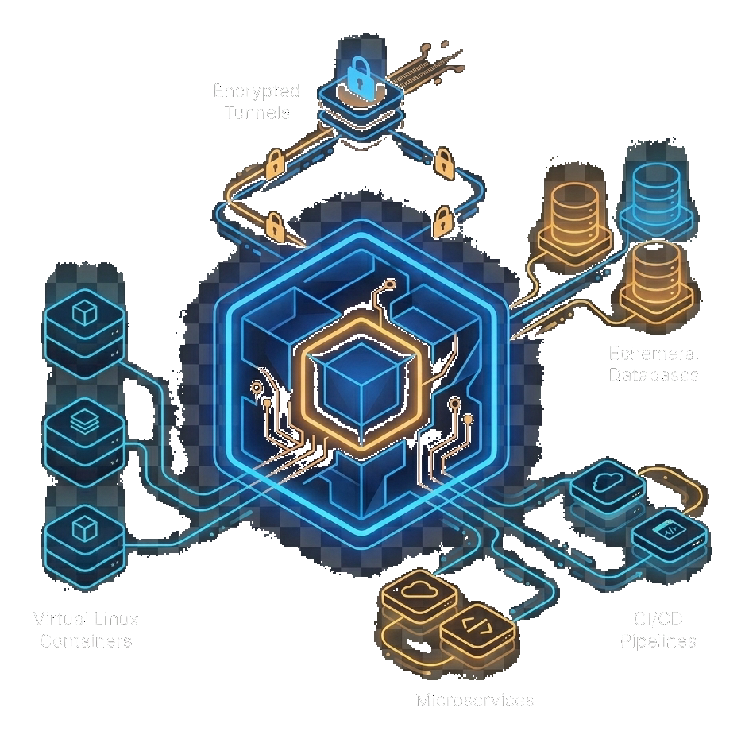
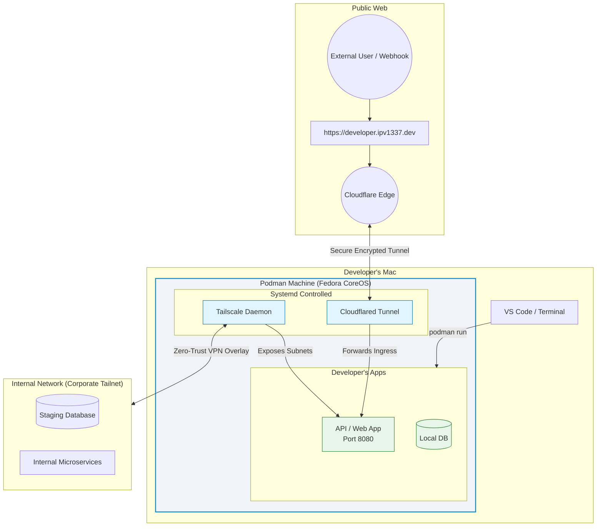

<p align="center">
  <h1 align="center">⚡ devx</h1>
  <p align="center">Supercharged local dev environment — Podman + Cloudflare Tunnels + Tailscale in one CLI</p>
  <p align="center">
    <a href="https://github.com/VitruvianSoftware/devx/actions/workflows/ci.yml"></a>
    <a href="https://github.com/VitruvianSoftware/devx/releases/latest"></a>
    <a href="https://github.com/VitruvianSoftware/devx/blob/main/LICENSE"></a>
    <a href="https://goreportcard.com/report/github.com/VitruvianSoftware/devx"></a>
  </p>
</p>

<p align="center">
  
</p>

---

`devx` provisions a customized **Fedora CoreOS** VM via Podman Machine and automatically configures **Cloudflare Tunnels** (instant public HTTPS) and **Tailscale** (zero-trust corporate network access) — all from a single command.

## The Problem

Local development is plagued by recurring friction:

1. **"It works on my machine"** — Inconsistent host OS configs, file watcher limits, kernel parameters
2. **Accessing internal services** — Developers need corporate APIs/databases without routing everything through a slow VPN
3. **Webhooks & sharing** — Testing Stripe/GitHub webhooks or sharing a prototype requires sketchy ngrok setups

## The Solution

```bash
devx vm init    # One command. Done.
```

You get a fully-configured Fedora CoreOS VM with:

- 🌐 **Instant public HTTPS** — Your machine gets `your-name.ipv1337.dev` automatically
- 🔒 **Zero-trust corporate access** — The VM joins your Tailnet transparently
- 🚀 **ngrok-like port exposure** — `devx tunnel expose 3000` gives you a public URL in seconds
- 🏗️ **Host-level isolation** — Pre-tuned `inotify` limits, rootful containers, dedicated kernel

## Installation

### From Releases (recommended)

Download the latest binary from [GitHub Releases](https://github.com/VitruvianSoftware/devx/releases/latest):

```bash
# macOS (Apple Silicon)
curl -sL https://github.com/VitruvianSoftware/devx/releases/latest/download/devx_darwin_arm64.tar.gz | tar xz
sudo mv devx /usr/local/bin/

# macOS (Intel)
curl -sL https://github.com/VitruvianSoftware/devx/releases/latest/download/devx_darwin_amd64.tar.gz | tar xz
sudo mv devx /usr/local/bin/

# Linux (amd64)
curl -sL https://github.com/VitruvianSoftware/devx/releases/latest/download/devx_linux_amd64.tar.gz | tar xz
sudo mv devx /usr/local/bin/
```

### From Source

```bash
go install github.com/VitruvianSoftware/devx@latest
```

### Prerequisites

These tools must be installed before running `devx vm init`:

| Tool | Install | Purpose |
|------|---------|---------|
| [Podman](https://podman.io) | `brew install podman` | VM and container runtime |
| [cloudflared](https://developers.cloudflare.com/cloudflare-one/connections/connect-networks/get-started/) | `brew install cloudflare/cloudflare/cloudflared` | Cloudflare tunnel daemon |
| [butane](https://coreos.github.io/butane/) | `brew install butane` | Ignition config compiler |

## Quick Start

```bash
# 1. Authenticate with Cloudflare (one-time)
cloudflared login

# 2. Provision your dev environment
devx vm init

# 3. Run something and expose it
devx exec podman run -d -p 8080:80 docker.io/nginx
# Visit https://your-name.ipv1337.dev — it's live!

# 4. Expose any local port instantly (like ngrok)
devx tunnel expose 3000 --name myapp
# → https://myapp.your-name.ipv1337.dev
```

## Architecture



## CLI Reference

```
devx — Supercharged local dev environment

Commands:
  vm          Manage the local development VM
  tunnel      Manage Cloudflare tunnels and port exposure
  config      Manage devx configuration and credentials
  exec        Run low-level infrastructure tools directly
  version     Print the devx version
```

### VM Management (`devx vm`)

| Command | Description |
|---------|-------------|
| `devx vm init` | Full first-time provisioning with interactive TUI |
| `devx vm status` | Show health of VM, Cloudflare tunnel, and Tailscale |
| `devx vm teardown` | Stop and permanently remove the VM (prompts for confirmation) |
| `devx vm ssh` | Drop into an SSH shell inside the VM |

### Tunnel & Port Exposure (`devx tunnel`)

| Command | Description |
|---------|-------------|
| `devx tunnel expose [port]` | Expose a local port to the internet via `*.ipv1337.dev` |
| `devx tunnel expose [port] --name myapp` | Use a static subdomain (`myapp.you.ipv1337.dev`) |
| `devx tunnel inspect [port]` | Live TUI to inspect and replay HTTP traffic (like ngrok inspect) |
| `devx tunnel list` | List all active port exposures with URLs and ports |
| `devx tunnel unexpose` | Clean up all exposed tunnels |
| `devx tunnel update` | Rotate Cloudflare credentials without rebuilding the VM |

### 🔍 Request Inspector (`devx tunnel inspect`)

A free, open-source replacement for ngrok's paid web inspector. Captures every HTTP request and response flowing through your tunnel in a live terminal UI.

```bash
# Inspect traffic to a local app (local-only, no tunnel)
devx tunnel inspect 8080

# Inspect AND expose via Cloudflare tunnel
devx tunnel inspect 3000 --expose

# With a static subdomain
devx tunnel inspect 8080 --name myapi
```

**Features:**
- 📋 Live scrollable request list with method, path, status, and duration
- 🔎 Detailed view showing full request/response headers and bodies
- 🔁 One-key replay (`r`) to resend any captured request
- 🏷️ Replay tagging so you can compare original vs replayed responses
- 🧹 Clear captured requests with `c`

### Configuration (`devx config`)

| Command | Description |
|---------|-------------|
| `devx config secrets` | Interactive credential setup / rotation for `.env` |

### Low-Level Tools (`devx exec`)

Pass-through wrappers that forward arguments directly to the underlying tools:

| Command | Description |
|---------|-------------|
| `devx exec podman [args]` | Run Podman commands against the VM |
| `devx exec tailscale [args]` | Interact with the VM's Tailscale daemon |
| `devx exec cloudflared [args]` | Run cloudflared commands directly |
| `devx exec butane [args]` | Run butane commands directly |

## Configuration

devx reads its secrets from a `.env` file in the current directory. Copy the example and fill in your values:

```bash
cp .env.example .env
# Edit .env with your Cloudflare tunnel token and hostname
```

See `.env.example` for all available configuration options.

## Contributing

We welcome contributions! Please read our [Contributing Guide](CONTRIBUTING.md) for details on:

- Development setup
- Code style and conventions
- Pull request process
- Commit message format

## License

[MIT](LICENSE) © VitruvianSoftware