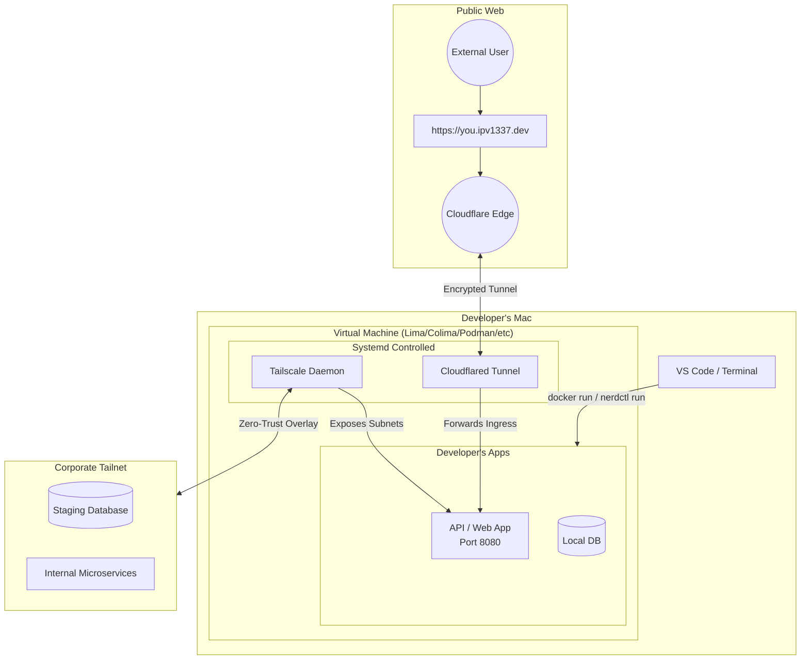

# Architecture

## System Overview

`devx` orchestrates three infrastructure layers from a single CLI:



## Components

### Virtual Machine Layer

The foundation is a VM managed by your chosen provider (Lima, Colima, Docker, OrbStack, or Podman). By default, we use **Fedora CoreOS** because:

- **Immutable OS** — The root filesystem is read-only, preventing drift
- **Ignition provisioning** — Configuration is applied atomically at first boot
- **Auto-updates** — CoreOS updates itself via OSTree without user intervention
- **Container-optimized** — Minimal footprint, purpose-built for running containers

`devx vm init` compiles a [Butane](https://coreos.github.io/butane/) config into Ignition format and injects it during VM creation.
*(Note: Some providers like Docker Desktop and OrbStack handle their own lightweight Linux kernel and do not run Fedora CoreOS).*

### Cloudflare Tunnel (Public Access)

Each VM gets a dedicated Cloudflare Tunnel that:

1. Creates an outbound-only connection to Cloudflare's edge network
2. Routes traffic from `*.ipv1337.dev` subdomains to local ports
3. Provides automatic TLS termination — no cert management needed
4. Runs as a `systemd` unit inside the VM

The `devx tunnel expose` command dynamically adds DNS routes without restarting the tunnel.

### Tailscale (Private Access)

Tailscale provides zero-trust access to internal services:

- The VM joins your Tailnet using a pre-authenticated auth key
- Services on the Tailnet (databases, APIs, dashboards) are reachable from inside the VM
- No traditional VPN — traffic goes peer-to-peer via WireGuard

## CLI Architecture

```
devx
├── vm          # VM lifecycle (init, status, teardown, resize, ssh)
├── tunnel      # Cloudflare tunnel management (expose, unexpose, list)
├── db          # Database provisioning (spawn, list, rm)
├── sites       # GitHub Pages + Cloudflare DNS (init, verify, status)
├── agent       # AI agent skill configuration
├── shell       # Devcontainer-based isolated shells
├── config      # Credential and configuration management
├── exec        # Raw passthrough to infrastructure tools
├── bridge      # Hybrid edge-to-local K8s routing (Idea 46)
└── up          # Declarative provisioning from devx.yaml
```

Each subcommand group is self-contained in `cmd/` and communicates with backend services through packages in `internal/`:

- `internal/cloudflare/` — Cloudflare API client (DNS, tunnels)
- `internal/github/` — GitHub API client (Pages, repos)
- `internal/ignition/` — Butane/Ignition config generation
- `internal/bridge/` — Kubernetes port-forward orchestration, intercept lifecycle, Yamux tunnels, and session management
- `internal/bridge/agent/` — Standalone Go module for the self-healing agent binary (deployed as a Kubernetes Job)

## Bridge Layer (Remote Cluster Access)

`devx bridge` extends the local environment to remote Kubernetes clusters following the **Client-Driven Architecture** principle:

- **Idea 46.1 (Shipped):** Outbound connectivity via `kubectl port-forward` — purely client-side, no cluster modifications
- **Idea 46.2 (Shipped):** Inbound traffic interception via self-healing agent pods. Deploys an ephemeral agent Job that mirrors the target Service's ports, swaps the selector, and tunnels inbound cluster traffic to the developer's local machine via Yamux multiplexing over `kubectl port-forward`
- **Idea 46.3 (Shipped):** Full hybrid topology orchestrated by `devx up` — `runtime: bridge` services with connect/intercept modes participate in the DAG with correct dependency ordering, unified lifecycle, and bridge-native health checks

Bridge injects `BRIDGE_*_URL` environment variables into `devx shell`, enabling local code to reach remote services without application-level changes.

