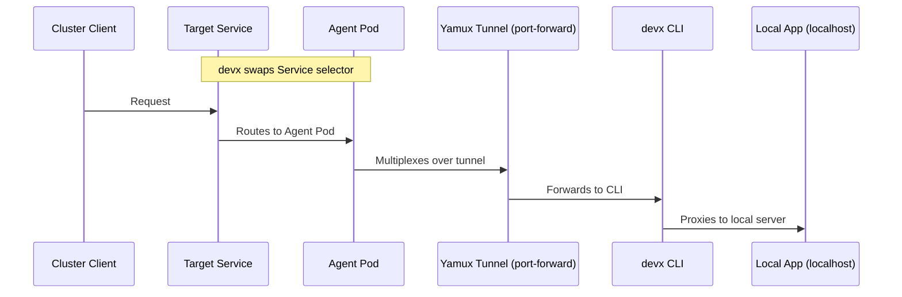

# Hybrid Bridge

Connect your local development environment to remote Kubernetes services for real-time cross-boundary debugging.

## Overview

`devx bridge` establishes secure tunnels from your local machine to remote Kubernetes services via `kubectl port-forward`. This enables you to run your local service while it communicates with real staging infrastructure — no application code changes required.

::: tip Client-Driven Architecture
Bridge follows devx's **Client-Driven Architecture** principle. In Phase 1, all operations are purely client-side using `kubectl port-forward`. No cluster-side agents or controllers are deployed. Future phases will use ephemeral, auto-cleaning agent pods for traffic interception.
:::

## Prerequisites

- `kubectl` installed and on your PATH
- A valid kubeconfig with access to your target cluster
- VPN connected (if your cluster requires it)

Run `devx doctor` to verify:

```bash
devx doctor
# Feature Readiness:
#   ✓  devx bridge connect   ready
```

## Quick Start

### Configuration in `devx.yaml`

```yaml
bridge:
  kubeconfig: ~/.kube/config
  context: gke_my-org_us-central1_staging
  namespace: default
  targets:
    - service: payments-api
      port: 8080
    - service: user-service
      port: 3000
    - service: redis
      namespace: cache
      port: 6379
      local_port: 16379  # optional: pin to a specific local port
```

### Connect

```bash
# Using devx.yaml configuration
devx bridge connect

# Ad-hoc (no devx.yaml needed)
devx bridge connect --context staging -t payments-api:8080 -t redis:6379
```

### What Happens

1. **Validates** your kubeconfig and cluster access
2. **Establishes** `kubectl port-forward` tunnels for each target service
3. **Generates** `~/.devx/bridge.env` with environment variables:
   ```bash
   BRIDGE_PAYMENTS_API_URL=http://127.0.0.1:9501
   BRIDGE_PAYMENTS_API_HOST=127.0.0.1
   BRIDGE_PAYMENTS_API_PORT=9501
   ```
4. **Injects** these variables automatically into `devx shell`

### Use in Your Application

When you run `devx shell`, bridge variables are auto-injected:

```bash
devx shell
# 🔗 Bridge active — injected 6 BRIDGE_* env vars from staging cluster

# Inside the container, use the env vars:
echo $BRIDGE_PAYMENTS_API_URL  # http://127.0.0.1:9501
curl $BRIDGE_PAYMENTS_API_URL/health
```

## Commands

### `devx bridge connect`

Establish outbound bridge to remote cluster services.

```bash
devx bridge connect [flags]

Flags:
  --kubeconfig    Path to kubeconfig file (default: ~/.kube/config)
  --context       Kubernetes context to use
  -n, --namespace Default namespace for target services
  -t, --target    Ad-hoc target: service:port or service:port:localport (repeatable)
  --json          Machine-readable output for AI agents
  -y              Non-interactive mode
  --dry-run       Show what would be bridged without connecting
```

### `devx bridge status`

Show active bridge sessions.

```bash
devx bridge status
# 🔗 devx bridge status
#   config:   /Users/you/.kube/config
#   context:  gke_my-org_us-central1_staging
#   uptime:   2m30s (23:15:00)
#
#   Active Bridges
#     ✓  default/payments-api :8080 → localhost:9501  healthy
#     ✓  cache/redis :6379 → localhost:16379  healthy
```

### `devx bridge disconnect`

Tear down all active bridges and clean up session files.

```bash
devx bridge disconnect       # interactive confirmation
devx bridge disconnect -y    # auto-confirm
devx bridge disconnect --dry-run  # preview
```

## Profile Overrides

You can override bridge configuration per profile:

```yaml
bridge:
  context: staging
  namespace: default
  targets:
    - service: api
      port: 8080

profiles:
  production-debug:
    bridge:
      context: production
      namespace: critical
      targets:
        - service: api
          port: 8080
```

```bash
devx bridge connect --profile production-debug
```

## Error Handling

Bridge uses deterministic `devxerr` exit codes for programmatic error handling:

| Exit Code | Constant | Meaning |
|-----------|----------|---------|
| 60 | `CodeBridgeKubeconfigNotFound` | kubeconfig file does not exist |
| 61 | `CodeBridgeContextUnreachable` | Cluster API server is unreachable |
| 62 | `CodeBridgeNamespaceNotFound` | Target namespace does not exist |
| 63 | `CodeBridgeServiceNotFound` | Target service not found |
| 64 | `CodeBridgePortForwardFailed` | Port-forward crashed after retries |
| 65 | `CodeBridgeAgentDeployFailed` | Agent Job failed to deploy |
| 66 | `CodeBridgeAgentHealthFailed` | Agent health check timed out |
| 67 | `CodeBridgeSelectorPatchFailed` | Failed to patch Service selector |
| 68 | `CodeBridgeRBACInsufficient` | Insufficient RBAC permissions |
| 69 | `CodeBridgeInterceptActive` | Service already intercepted |
| 70 | `CodeBridgeUnsupportedProtocol` | UDP port (not supported) |
| 71 | `CodeBridgeTunnelFailed` | Yamux tunnel failed |
| 72 | `CodeBridgeServiceNotInterceptable` | ExternalName or no selector |

## Resilience

- **Auto-reconnect:** If a `kubectl port-forward` drops due to a transient API server blip, bridge automatically retries with exponential backoff (1s, 2s, 4s) up to 3 times before surfacing a failure.
- **Port collision:** If your requested local port is in use, bridge auto-shifts to a free port (consistent with `devx db spawn` behavior).
- **Graceful shutdown:** Press `Ctrl+C` to tear down all bridges cleanly.

## Traffic Interception

Route real cluster traffic to your local machine for live debugging. An ephemeral agent pod is deployed to the cluster and the target Service's selector is temporarily swapped to redirect traffic through a Yamux multiplexed tunnel to your local application.

### How It Works

1. `devx` deploys a self-healing agent Job with a dynamically-generated Pod spec that mirrors the target Service's ports (including named ports)
2. The target Service's selector is patched to point at the agent pod
3. `devx` establishes a `kubectl port-forward` to the agent's control port and opens a Yamux client session
4. When a cluster client sends a request, the agent opens a new Yamux stream back to the CLI, which proxies it to `localhost`
5. On shutdown (Ctrl+C), the original selector is restored and the agent is removed
6. If `devx` crashes, the agent detects the tunnel drop and **automatically restores the selector** (self-healing)



### Quick Start

```bash
# Intercept all traffic to payments-api
devx bridge intercept payments-api --steal

# Specify ports explicitly
devx bridge intercept payments-api --steal --port 8080 --local-port 8080

# Use a custom agent image (air-gapped clusters)
devx bridge intercept payments-api --steal --agent-image my-reg/agent:v1

# Dry-run: preview without modifying the cluster
devx bridge intercept payments-api --steal --dry-run
```

### Configuration in `devx.yaml`

```yaml
bridge:
  kubeconfig: ~/.kube/config
  context: gke_my-org_us-central1_staging
  namespace: default
  agent_image: ""  # optional: override default ghcr.io/VitruvianSoftware/devx-bridge-agent

  # Outbound connectivity
  targets:
    - service: redis
      port: 6379

  # Inbound traffic interception
  intercepts:
    - service: payments-api
      port: 8080
      mode: steal
      local_port: 8080
```

### `devx bridge intercept`

Intercept inbound traffic from a remote Kubernetes service.

```bash
devx bridge intercept <service> [flags]

::: warning `mode: mirror` not supported
Currently, only `--steal` (or `mode: steal`) is supported. `mode: mirror` is planned for a future release.
:::

Flags:
  --steal            Full traffic redirect (required — explicit acknowledgment)
  -p, --port         Remote port to intercept (default: first port on Service)
  --local-port       Local port to route traffic to (default: same as --port)
  --agent-image      Override agent image (for air-gapped clusters)
  --kubeconfig       Path to kubeconfig
  --context          Kubernetes context
  -n, --namespace    Target namespace
  --json             Machine-readable output
  --dry-run          Preview without modifying the cluster
```

### `devx bridge rbac`

Generate the minimum RBAC manifest required for intercept.

```bash
devx bridge rbac                    # cluster-wide
devx bridge rbac -n staging         # namespace-scoped
devx bridge rbac | kubectl apply -f -  # apply directly
```

### RBAC Requirements

Intercept requires higher privileges than connect:

| Resource | Verbs | Purpose |
|----------|-------|---------|
| `batch/jobs` | create, delete, get, list | Agent Job lifecycle |
| `serviceaccounts` | create, delete | Agent ServiceAccount |
| `roles`, `rolebindings` | create, delete | Agent RBAC |
| `services` | get, list, update, patch | Selector swap + discovery |
| `pods` | get, list | Pod discovery |
| `pods/portforward` | create | Tunnel establishment |

Generate the complete RBAC manifest with `devx bridge rbac`.

### Safety Mechanisms

| Mechanism | Description |
|-----------|-------------|
| **Self-healing agent** | Agent monitors Yamux connection; on disconnect or SIGTERM, automatically restores the original Service selector |
| **Dedicated ServiceAccount** | Agent runs with a narrow RBAC role scoped to `update` on the specific target Service only |
| **Yamux heartbeat** | Keepalives every 10s; no response in 30s triggers self-healing |
| **activeDeadlineSeconds** | Agent auto-terminates after 4 hours as a last-resort safety net |
| **Session annotation** | Service is annotated with `devx-bridge-session` to prevent double-intercept |
| **Dynamic port mirroring** | Agent Pod spec mirrors target Service's named ports for correct Endpoints resolution |

### Service Mesh Limitations {#service-mesh}

Service mesh environments (Istio, Linkerd) are **not supported** in the current version. If a mesh sidecar is detected, `devx` prints a warning but proceeds. The selector swap may not work correctly with mesh-injected pods because the mesh control plane may override or ignore the selector change.

## Hybrid Topology: `runtime: bridge` in `devx up`

The standalone `devx bridge connect` and `devx bridge intercept` commands remain available for ad-hoc use. But for full lifecycle integration, bridge services can be declared inline in `devx.yaml`'s `services:` array with `runtime: bridge`. This makes them first-class participants in the `devx up` DAG orchestrator — with dependency ordering, health gating, and unified cleanup.

### Declaring Bridge Services

```yaml
bridge:
  kubeconfig: ~/.kube/config
  context: gke_my-org_us-central1_staging
  namespace: staging

services:
  # Outbound: expose a remote K8s service locally
  - name: remote-payments
    runtime: bridge
    bridge_target:
      service: payments-api
      port: 8080
      local_port: 8080

  # Inbound: steal cluster traffic to local dev server
  - name: user-svc-intercept
    runtime: bridge
    bridge_intercept:
      service: user-service
      port: 3000
      local_port: 3000
      mode: steal
    depends_on:
      - name: local-user-svc
        condition: service_healthy

  # Local service depending on the bridged remote
  - name: local-api
    runtime: host
    command: ["go", "run", "./cmd/api"]
    port: 9090
    depends_on:
      - name: remote-payments
        condition: service_healthy
```

### How It Works

| Aspect | Connect (`bridge_target`) | Intercept (`bridge_intercept`) |
|--------|---------------------------|-------------------------------|
| **Blocking** | `pf.Start()` blocks forever → spawned in goroutine | Setup (deploy agent, patch selector, start tunnel) is finite (~10-30s) → runs synchronously |
| **Healthcheck** | Polls `pf.State()` natively — avoids naive TCP | No separate healthcheck needed — returning `nil` from setup IS the readiness signal |
| **Cleanup** | Kills `kubectl port-forward` subprocess | Restores selector → removes agent → stops Yamux tunnel |
| **Session** | Entries marked `Origin: "dag"` | Entries marked `Origin: "dag"` |

### Session Isolation

DAG-managed bridge sessions are tagged with `Origin: "dag"` in `~/.devx/bridge.json`. Running `devx bridge disconnect` while `devx up` is active will **skip** these entries and print a warning — only standalone bridges are torn down. Stopping `devx up` (Ctrl+C) triggers the full DAG cleanup in reverse order.

### Environment Variables

After all bridge services are healthy, `devx up` auto-generates `~/.devx/bridge.env` with `BRIDGE_<SERVICE>_URL` variables. These are injected into `devx shell` automatically.

## Future: DNS Proxy

Currently, applications must use `BRIDGE_*_URL` environment variables to reach bridged services. A future enhancement will add an optional `--dns` flag that starts a lightweight DNS proxy, allowing apps to use native k8s DNS names (e.g., `payments-api.default.svc.cluster.local`) without code changes.

