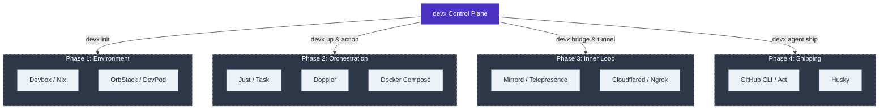

# Developer Experience (DevX) Tooling Landscape

To build `devx` into a ubiquitous, "single pane of glass" orchestration tool, we must first understand the modern Developer Experience lifecycle. 

This document maps the developer journey from **Day 1 (Onboarding)** to **Day N (Shipping & Maintenance)**, identifying core frustrations at each phase, the trending tools aiming to solve them, and how `devx` can adapt to become the ultimate integration layer without reinventing the wheel.

## 🗺️ The `devx` Control Plane Architecture

The following diagram illustrates how `devx` positions itself not as a replacement for all specialized tools, but as the unified orchestration layer connecting them across the entire developer lifecycle.

## 📊 Tooling Comparison Matrix

| Phase | Core Developer Frustration | Point Solutions in Ecosystem | The `devx` Unification Strategy |
| :--- | :--- | :--- | :--- |
| **Day 1: Environment** | Version mismatches, "It works on my machine", complex guides | Devbox, Devenv, DevPod, OrbStack | **`devx init`** - Orchestrates Nix & VMs transparently |
| **Day 1.5: Orchestrate** | Microservice sprawl, messy Makefiles, Slack `.env` sharing | Just, Task, Doppler, Docker Compose | **`devx up / action`** - DAG parallel execution & task wrapping |
| **Day 2: Inner-Loop** | Testing K8s APIs locally, webhook testing, long CI loops | Mirrord, Telepresence, Ngrok, Cloudflared | **`devx bridge / tunnel`** - Native lightweight secure tunnels |
| **Day N: Shipping** | CI/CD flakes, broken main branches, context switching | GitHub CLI (`gh`), Act, Husky | **`devx agent ship`** - Pre-flight gating & blocking CI polling |

---

## Phase 1: Day 1 — Environment Bootstrapping
**The Goal:** Time-to-first-commit. A new developer clones the repository and needs a working environment.

### 🔴 The Frustrations
- **The "It Works on My Machine" Problem:** Conflicting global dependencies (Node 18 vs Node 20), broken Homebrew symlinks, and outdated OS-level packages.
- **The "Read The Wiki" Problem:** Outdated, 50-step `README.md` onboarding guides that inevitably fail on step 7.
- **Host Pollution:** Installing global databases (Postgres, Redis) directly on the host machine, leading to port collisions and data corruption between projects.

### 🛠️ Trending Tools in the Ecosystem
- **Devbox / Devenv (Nix-based):** These tools replace `apt`/`brew`. They use the Nix package manager to provide hyper-isolated, declarative binary environments. If a project needs `go 1.21` and `nodejs 18`, these tools provide them seamlessly without polluting the host.
- **DevPod / Daytona (Devcontainers):** These tools take isolation a step further. Instead of isolating binaries, they spin up entire lightweight Virtual Machines or Containers (based on `devcontainer.json`) locally or in the cloud. 
- **OrbStack:** A significantly faster, lighter, and more battery-efficient drop-in replacement for Docker Desktop on macOS.

### 🚀 Where `devx` Fits
Currently, `devx` solves "host pollution" by orchestrating databases in Podman/Docker. However, it relies on the host machine to have the correct runtime (Go, Node, Python).
**The Vision:** `devx` shouldn't reinvent Nix or Devcontainers. Instead, `devx init` should natively *detect* and *orchestrate* Devbox or DevPod if they exist in the repository, seamlessly entering the reproducible shell before running any further commands.

---

## Phase 2: Day 1.5 — Local Orchestration & Task Running
**The Goal:** Running the stack. The developer has the binaries, now they need to spin up the APIs, frontends, and databases simultaneously.

### 🔴 The Frustrations
- **Microservice Sprawl:** Having to open 6 terminal tabs to run the frontend, backend, worker, Postgres, and Redis.
- **Docker Compose Fatigue:** Docker Compose is powerful but brittle. It's difficult to run *partial* stacks (e.g., "run everything except the frontend because I'm working on it natively").
- **Secret Management:** Sharing `.env` files over Slack because local configurations are too complex to document.
- **Tribal Knowledge Scripts:** `Makefile` syntax is notoriously finicky, leading to disorganized bash scripts scattered across the repo.

### 🛠️ Trending Tools in the Ecosystem
- **Just / Taskfile:** Modern command runners that replace `Makefiles`. They offer highly readable, standardized formats for repository tasks (e.g., `just build`, `task lint`).
- **Doppler / Infisical:** Local secret managers that securely inject `.env` variables into the local runtime without ever storing plaintext files on disk.

### 🚀 Where `devx` Fits
This is where `devx` currently shines.
- **DAG Orchestration:** `devx up` elegantly handles microservice sprawl by spinning up parallel dependencies. 
- **Task Running:** `devx action` successfully replaces `Just`/`Task` by wrapping native commands with telemetry.
**The Vision:** `devx` should become the universal "Play button." If a user has a `Justfile`, `devx action` should natively parse and run it. If they use Doppler, `devx` should automatically inject those secrets into the `devx up` DAG.

---

## Phase 3: Day 2 — Inner-Loop Development & Cloud Bridging
**The Goal:** Writing code that interacts with cloud-native infrastructure without having to deploy to the cloud to test it.

### 🔴 The Frustrations
- **The Cloud Wall:** Your local API needs to talk to a staging database, an internal gRPC service, or an AWS Lambda function that cannot be easily mocked locally.
- **Slow Feedback Loops:** The traditional cycle of `Commit -> Build Container -> Push to K8s -> Wait 10 minutes -> Check Logs` destroys developer momentum.
- **Webhook Hell:** Testing Stripe or GitHub webhooks requires exposing localhost to the public internet securely.

### 🛠️ Trending Tools in the Ecosystem
- **Telepresence / Mirrord:** The heavyweights of Kubernetes bridging. They allow developers to run a single microservice locally on their laptop while intercepting network traffic from a live staging Kubernetes cluster.
- **Ngrok / Cloudflared:** Tools for punching secure tunnels from localhost to the public internet to receive webhooks.

### 🚀 Where `devx` Fits
`devx` is exceptionally well-positioned here.
- **`devx bridge`:** Already implements a lightweight, Client-Driven alternative to Telepresence and Mirrord, explicitly designed to avoid the heavy cluster-side controllers those tools require.
- **`devx tunnel`:** Already seamlessly integrates with Cloudflared.
**The Vision:** Consolidate these networking layers so developers never have to think about them. `devx up` should be able to automatically spawn a local database, expose a tunnel for webhooks, and bridge to staging K8s for identity services—all from one YAML definition.

---

## Phase 4: Day N — Shipping & CI/CD Governance
**The Goal:** Getting code merged safely, quickly, and consistently.

### 🔴 The Frustrations
- **The "Oops, CI failed" Cycle:** Developers push code, context-switch to another task, realize 15 minutes later that a linter failed in GitHub Actions, and have to context-switch back to fix it.
- **Bypassed Guardrails:** Developers using `git commit --no-verify` to bypass annoying pre-commit hooks, leading to broken main branches.
- **Context Switching:** Having to leave the terminal, open a browser, navigate to GitHub, create a PR, and click "Auto-Merge."

### 🛠️ Trending Tools in the Ecosystem
- **GitHub CLI (`gh`):** Brings PR creation and workflow monitoring to the terminal.
- **Act:** Allows developers to run GitHub Actions locally in Docker before pushing.
- **Lefthook / Husky:** Fast, language-agnostic pre-commit hook managers.

### 🚀 Where `devx` Fits
The newly refactored `devx agent ship` and `devx agent review` commands are best-in-class solutions to these frustrations. 
By mandating local pre-flight checks and strictly blocking the terminal while `gh pr checks` runs, `devx` actively prevents context switching and broken windows.
**The Vision:** Evolve `devx agent ship` into a universal gateway. It should be able to interpret `Act` to run local CI validations if the project supports it, ensuring 100% parity between local tests and GitHub Actions before a commit ever leaves the machine.

---

## Conclusion: The `devx` Philosophy

Developers are exhausted by fragmentation. They don't want to learn 15 different tools (`nix`, `docker-compose`, `make`, `telepresence`, `ngrok`, `gh`).

**The ultimate goal of `devx` is not to replace all of these tools, but to be the unified control plane for them.** 
If a developer types `devx up`, the tool should seamlessly use Nix to get binaries, OrbStack to spin up databases, Cloudflared to expose webhooks, and Mirrord to connect to staging. `devx` succeeds by being highly opinionated in its user experience, but highly modular in its underlying infrastructure.
