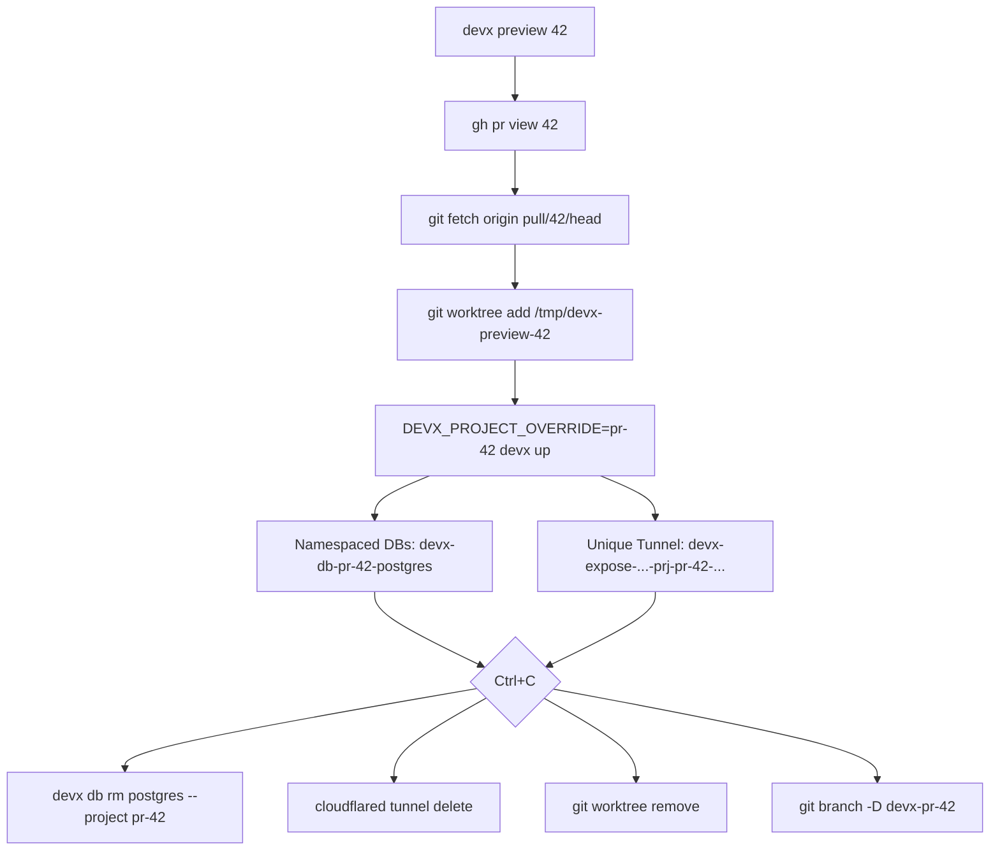

# PR Preview Sandbox

Stop context-switching to review pull requests. `devx preview` creates an isolated sandbox environment in seconds — dedicated worktree, namespaced databases, and unique tunnel URLs — without touching your current branch.

## Quick Start

```bash
devx preview 42
```

That's it. `devx` will:
1. Fetch the PR's code into an isolated git worktree
2. Provision namespaced databases (e.g., `devx-db-pr-42-postgres`)
3. Expose the PR's services on unique Cloudflare tunnel URLs
4. Block until you press `Ctrl+C`, then clean everything up automatically

## How It Works



### Database Isolation

When `devx preview` runs `devx up`, it sets the `DEVX_PROJECT_OVERRIDE` environment variable. This causes all database operations to use a namespaced prefix:

| Standard (`devx up`) | Preview (`devx preview 42`) |
|---|---|
| `devx-db-postgres` | `devx-db-pr-42-postgres` |
| `devx-data-postgres` | `devx-data-pr-42-postgres` |

Your active development databases are never touched.

### Tunnel Isolation

Cloudflare tunnels are created with the preview project name embedded, ensuring the PR gets its own unique public URL that doesn't interfere with your primary tunnel.

### Automatic Cleanup

On exit (`Ctrl+C` or `SIGTERM`), `devx preview` cleans up:
- ✗ Namespaced database containers and volumes
- ✗ Cloudflare tunnel and DNS entries
- ✗ Exposure store entries
- ✗ Git worktree directory
- ✗ Temporary local branch

If a preview session crashes, `devx nuke` will discover orphaned preview artifacts (containers matching `devx-db-pr-*` and stale worktrees) and include them in its cleanup selection.

## Prerequisites

| Requirement | Install |
|---|---|
| GitHub CLI (`gh`) | `brew install gh` |
| GitHub authentication | `gh auth login` |
| Git repository | Must be inside a git repo |
| `devx.yaml` in the PR | Required for database/tunnel provisioning |

Run `devx doctor` to verify all prerequisites are configured.

## CLI Reference

```bash
# Preview a PR
devx preview <pr-number>

# Dry-run (see what would happen)
devx preview <pr-number> --dry-run

# Non-interactive mode (skip all prompts)
devx preview <pr-number> -y

# JSON output (for AI agents)
devx preview <pr-number> --json
```

### Global Flags

| Flag | Effect |
|---|---|
| `--dry-run` | Print the worktree path, DB names, and actions without executing |
| `--json` | Emit structured JSON output (PR number, worktree, project name) |
| `-y` | Auto-confirm all interactive prompts during setup and teardown |
| `--env-file` | Forwarded to the `devx up` subprocess |

## The `--project` Flag

`devx preview` leverages a new `--project` flag on `devx db spawn` and `devx db rm`. This flag is also available for direct use:

```bash
# Create an isolated database
devx db spawn postgres --project my-experiment

# Remove it
devx db rm postgres --project my-experiment
```

This is useful for manual sandbox creation outside of the preview workflow.

## Limitations

- **Fork PRs** are not supported in this version. The PR must originate from the same repository.
- **One preview at a time** is recommended. Running multiple concurrent previews may cause port conflicts (though `devx` will attempt automatic port resolution).
- **Cloudflare authentication** is required if the PR's `devx.yaml` defines tunnels.

## Related Commands

- [`devx up`](orchestration.md) — The underlying orchestrator that `preview` delegates to
- [`devx db spawn`](databases.md) — Database provisioning (now with `--project` support)
- [`devx nuke`](nuke.md) — Discovers and cleans orphaned preview artifacts
- [`devx doctor`](doctor.md) — Verifies prerequisites including `gh` CLI
