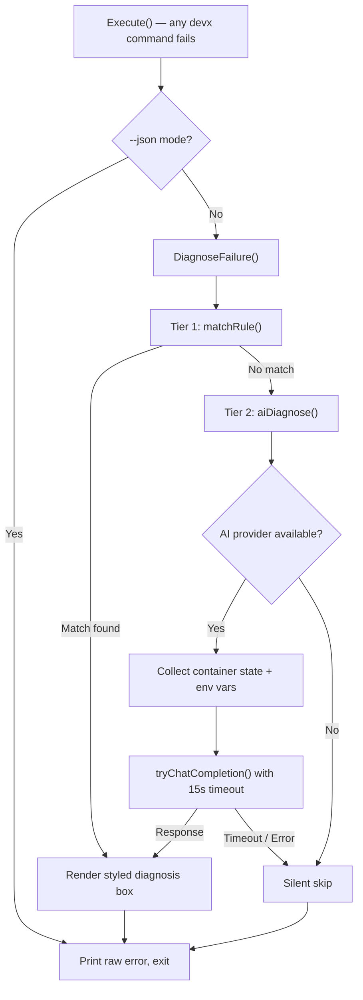
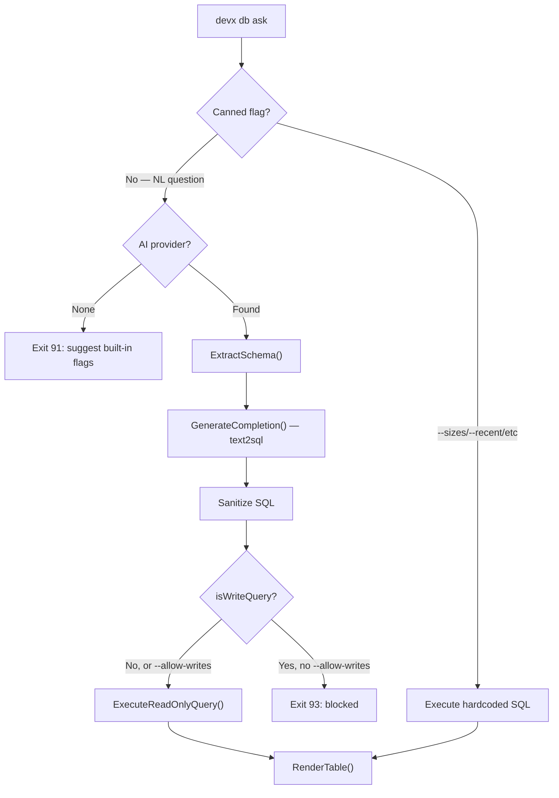

# Walkthrough: Idea 59 & 60 — AI Failure Recovery + `devx db ask`

## Overview

Implemented two AI-powered features that build on the `internal/ai` foundation (Idea 64):

1. **Idea 59 — Intelligent Failure Recovery**: A two-tier diagnosis engine that automatically explains errors across every `devx` command.
2. **Idea 60 — `devx db ask`**: Natural language database queries with built-in diagnostic shortcuts.

Both features are zero-config, respect all global flags (`--json`, `--dry-run`, `-y`), and degrade gracefully without AI.

---

## Changes Made

### New Files

| File | Purpose |
|------|---------|
| [diagnose.go](file:///Users/james/Workspace/gh/application/vitruvian/devx/internal/ai/diagnose.go) | Two-tier diagnosis engine: 16 rule-based patterns + AI-enhanced analysis |
| [diagnose_test.go](file:///Users/james/Workspace/gh/application/vitruvian/devx/internal/ai/diagnose_test.go) | 8 unit tests covering rule matching, case insensitivity, edge cases |
| [query.go](file:///Users/james/Workspace/gh/application/vitruvian/devx/internal/database/query.go) | Canned queries, read-only executor, tab-separated parser, lipgloss table renderer |
| [query_test.go](file:///Users/james/Workspace/gh/application/vitruvian/devx/internal/database/query_test.go) | 7 unit tests for parsing, rendering, and registry completeness |
| [db_ask.go](file:///Users/james/Workspace/gh/application/vitruvian/devx/cmd/db_ask.go) | Cobra command supporting `--sizes`, `--recent`, `--missing-indexes`, `--nulls`, and NL queries |

### Modified Files

| File | Change |
|------|--------|
| [root.go](file:///Users/james/Workspace/gh/application/vitruvian/devx/cmd/root.go) | Hooked `ai.DiagnoseFailure()` into `Execute()` — intercepts all command errors before exit |
| [error.go](file:///Users/james/Workspace/gh/application/vitruvian/devx/internal/devxerr/error.go) | Added exit codes 90-93 for diagnosis and db ask features |
| [FEATURES.md](file:///Users/james/Workspace/gh/application/vitruvian/devx/FEATURES.md) | Added Ideas 59 & 60 as shipped features |
| [IDEAS.md](file:///Users/james/Workspace/gh/application/vitruvian/devx/IDEAS.md) | Removed shipped Ideas 59 & 60 from active list |

---

## Architecture

### Idea 59 — Failure Diagnosis Flow



### Idea 60 — `devx db ask` Flow



---

## Testing

All 32 tests pass:

```
ok  github.com/VitruvianSoftware/devx/internal/ai        0.559s  (14 tests)
ok  github.com/VitruvianSoftware/devx/internal/database   0.749s  (18 tests)
```

Lint: `0 issues` via `golangci-lint run`.

---

## Key Design Decisions

1. **Centralized hook in `Execute()`** — rather than sprinkling `defer diagnose()` into 30+ commands, we intercept all errors in one place. This means every future command automatically gets diagnosis for free.
2. **Rule-based baseline is always available** — the ~16 patterns work without any AI provider. The LLM is a silent enhancement.
3. **15-second AI timeout** — a failed command already creates frustration; we don't add to it by hanging on a slow model.
4. **Read-only by default** — `db ask` wraps everything in `BEGIN TRANSACTION READ ONLY`. The `--allow-writes` flag requires explicit opt-in with interactive confirmation.
5. **Canned queries work without AI** — `--sizes`, `--recent`, `--missing-indexes`, `--nulls` execute hardcoded, hand-tuned SQL. This makes `db ask` useful even in environments without local models.
